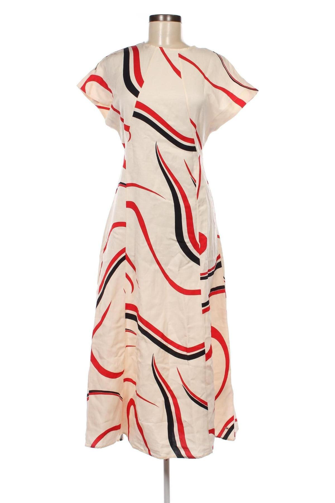

# garment-category-predictor

A computer vision API that predicts clothing categories from images using a Vision Transformer (ViT) model. The API analyzes garment images and returns the most likely clothing categories with confidence scores.

# Docker 🐋

**Build the image**
```bash
docker build -t garment-category-api .
```

**Run the container**
```bash
docker run -it -p 5000:5000 -e PYTHONUNBUFFERED=1 garment-category-api
```

# API Endpoints

## Health Check ❤️

Test if the API is running:

```bash
curl http://127.0.0.1:5000/health
```

**Expected Response:**
```json
{
  "status": "healthy",
  "message": "API is running"
}
```

## Category Prediction Endpoint 👕

Get clothing category predictions from an image.

### With image_url:
```bash
curl -X POST http://127.0.0.1:5000/category \
  -H "Content-Type: application/json" \
  -d '{"image_url": "https://example.com/image.jpg"}'
```

**Expected Response:**
```json
{
  "success": true,
  "topx": [
    ["Blouses", 0.85],
    ["T-Shirts", 0.12]
  ]
}
```

## Example Usage 🖼️

### Single Category Prediction (High Confidence)
```bash
curl -X POST http://127.0.0.1:5000/category \
  -H "Content-Type: application/json" \
  -d '{"image_url": "https://example.com/shirt.jpg"}'
```

Response for clear shirt image:
```json
{
  "success": true,
  "topx": [
    ["Shirts", 0.95]
  ]
}
```

### Multiple Category Predictions (Lower Confidence)
```bash
curl -X POST http://127.0.0.1:5000/category \
  -H "Content-Type: application/json" \
  -d '{"image_url": "https://example.com/ambiguous-garment.jpg"}'
```

Response for ambiguous garment:
```json
{
  "success": true,
  "topx": [
    ["Blouses", 0.65],
    ["Sweaters", 0.25],
    ["T-Shirts", 0.10]
  ]
}
```

## Prediction Logic 🧠

The API uses intelligent rules to provide the most relevant predictions:

- **High Confidence (≥0.85)**: Returns single best prediction
- **Medium Confidence (0.5-0.85)**: Returns top 2-3 predictions  
- **Special Cases**: 
  - Blouses with Sweaters as second choice
  - Jumpsuits (always returns top 2)
  - Shirts (also suggests T-Shirts)
  - Skirts/Shorts (suggests the other as alternative)

## Example Results 🖼️

**Sample Image Classification:**



**API Response:**
```json
{
  "success": true,
  "topx": [
    ["Dresses", 0.9865]
  ]
}
```


## Error Handling 🚨

### Missing Image URL
```bash
curl -X POST http://127.0.0.1:5000/category \
  -H "Content-Type: application/json" \
  -d '{}'
```

**Response:**
```json
{
  "error": "image is required"
}
```

### Failed Image Loading
If the image URL is invalid or inaccessible:
```json
{
  "success": false,
  "error": "Failed to load image!"
}
```

## Pretty JSON Output 📄

For formatted JSON responses, pipe the output through `jq`:
```bash
curl -X POST http://127.0.0.1:5000/category \
  -H "Content-Type: application/json" \
  -d '{"image_url": "https://example.com/garment.jpg"}' | jq
```

## Technical Details 🔧

- **Model**: Vision Transformer (ViT) fine-tuned for clothing classification
- **Framework**: PyTorch + Transformers (Hugging Face)
- **Web Framework**: Flask + Gunicorn
- **Image Processing**: PIL, OpenCV
- **Cloud Storage**: AWS S3 integration

## Notes 📝
- Images must be publicly accessible URLs
- Supported formats: JPG, PNG, WebP, JPEG
- The model automatically handles image preprocessing and normalization
- Results are post-processed using business logic to improve relevance