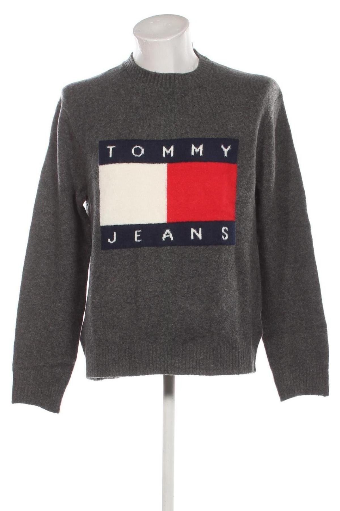
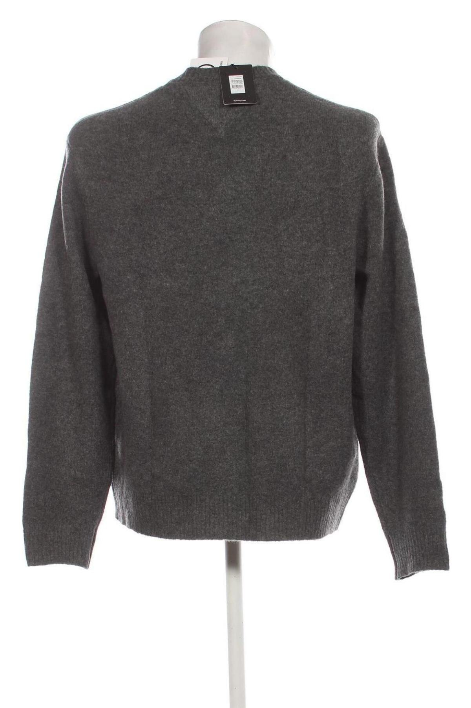
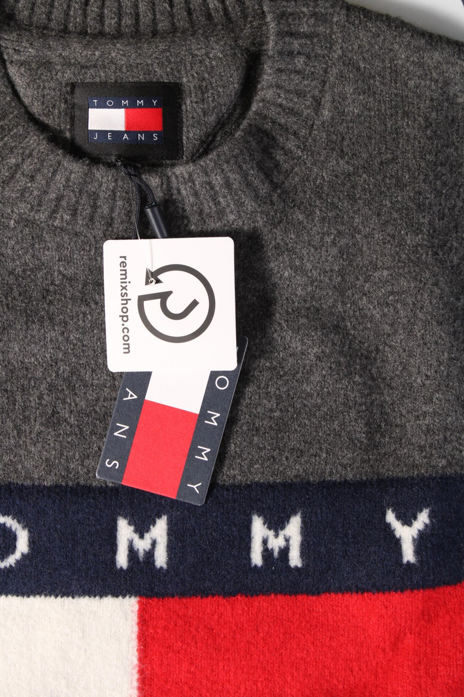

# Garment Attribute Predictor API

A machine learning-powered REST API that analyzes garment condition from images using computer vision and OpenAI's GPT models. The system combines a custom Vision Transformer (ViT) model for initial assessment with OpenAI's advanced image analysis capabilities to provide detailed condition ratings and descriptions.

## Features

- **Automated Condition Assessment**: Uses a fine-tuned ViT model to detect new products with tags
- **Detailed Analysis**: Leverages OpenAI GPT-4 Vision for comprehensive condition evaluation
- **AWS S3 Integration**: Seamless image storage and model artifact management
- **Production Ready**: Docker containerized with Gunicorn WSGI server
- **Comprehensive Logging**: Automated logging to local files and S3

## Prerequisites

- Python 3.9+
- OpenAI API Key
- AWS S3 Access (for model artifacts and image storage)
- Docker (for containerized deployment)


## Docker Deployment

1. **Build the Docker image**
   ```bash
   docker build -t garment-predictor-api .
   ```

2. **Run the container**
   ```bash
   docker run -p 5000:5000 -e PYTHONUNBUFFERED=1 garment-predictor-api
   ```

## API Endpoints

### 1. Health Check

**Endpoint:** `GET /health`

**Description:** Check if the API is running and healthy.

**Response:**
```json
{
  "status": "healthy",
  "message": "API is running"
}
```

**Example:**
```bash
curl http://localhost:5000/health
```

### 2. Condition Assessment

**Endpoint:** `POST /condition`

**Description:** Analyzes garment condition from provided image URLs.

**Request Body:**
```json
{
  "image_urls": [
    "https://example.com/image1.jpg",
    "https://example.com/image2.jpg",
    "https://example.com/image3.jpg"
  ]
}
```

**Response:**
```json
{
  "condition_rating": "This product has no signs of use.",
  "condition_description": ""
}
```

**Example:**
```bash
curl -X POST http://localhost:5000/condition \
  -H "Content-Type: application/json" \
  -d '{
    "image_urls": [
      "https://example.com/garment-front.jpg",
      "https://example.com/garment-back.jpg",
      "https://example.com/garment-detail.jpg"
    ]
  }'
```

| Image 1 | Image 2 | Image 3 |
|---------|---------|---------|
|  |  |  |

**Response:**
```bash
{
  "condition_rating": "New product with tags.",
  "condition_description": ""
}
```

**Possible Condition Ratings:**
- `"New product with tags."` - Brand new item with original tags
- `"This product has no signs of use."` - Excellent condition, like new
- `"This product has barely noticeable signs of use."` - Minor wear detected


**Error Responses:**

- `400 Bad Request`: Invalid input (missing image URLs, empty list, etc.)
- `500 Internal Server Error`: Processing error or model failure

## How It Works

1. **Initial Assessment**: A fine-tuned Vision Transformer model analyzes the last (sorted) image URL to detect new products with tags
2. **Confidence Evaluation**: If confidence is high (≥99.5%), the item is classified as "New product with tags"
3. **Detailed Analysis**: For lower confidence scores, the system uses OpenAI GPT-4 Vision to analyze all provided images
4. **Condition Rating**: Based on detected defects, the system provides appropriate condition ratings
5. **Description Generation**: When defects are found, detailed descriptions are generated for e-commerce use


## Logging

The application automatically logs all operations to:
- Local log files in the `logs/` directory
- AWS S3 bucket for centralized log management

Log files are created daily with the format: `evfsam{YYYY-MM-DD}.log`

## Production Deployment

The application is configured for production deployment with:
- Gunicorn WSGI server
- Single worker process (optimized for ML model inference)
- 10-minute timeout for model processing
- Automatic log rotation and S3 upload
- Health check endpoint for load balancer integration


